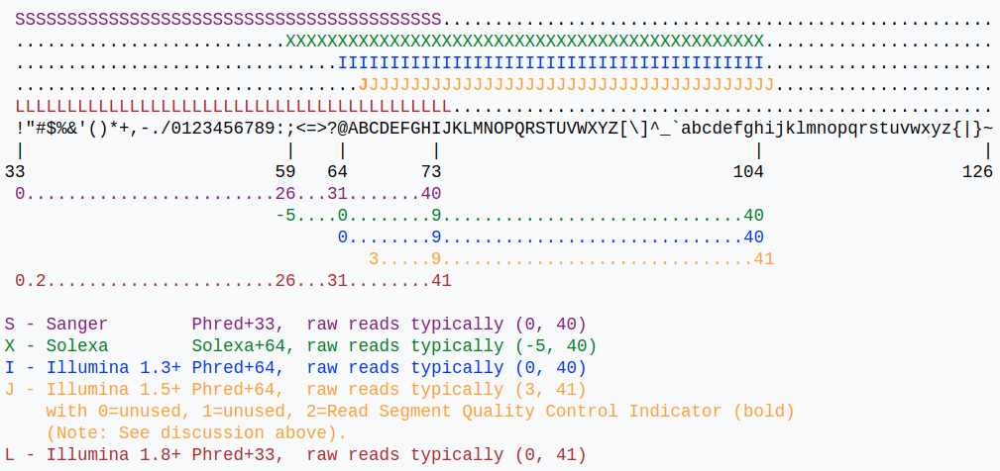

# 2-1 Introduction to FASTQ

> Jiacheng Eric Chuan @ CFIA  
> jiacheng.chuan@canada.ca

In the last lecture, we installed `fastqc` and `multiqc`, and ran a simple Bioinformatics analysis:

```sh
# Download the sequence file
wget https://github.com/cihga39871/LinuxTraining/raw/master/lab/1.ProgramInstallation/sample.fastq.gz

# Run Quality Control analysis for the sequence file
fastqc sample.fastq.gz
# output: `sample_fastqc.html` and `sample_fastqc.zip`

# Get a pretty version of quality control report
multiqc .
# output: `multiqc_report.html`
```

Today, we will learn what is a FASTQ file, and how to interpret the FASTQ Quality.

## 2-1.1 FASTQ file format

>  Reference: https://en.wikipedia.org/wiki/FASTQ_format

**FASTQ format** is a text-based [format](https://en.wikipedia.org/wiki/File_format) for storing both a biological sequence (usually [nucleotide sequence](https://en.wikipedia.org/wiki/Nucleotide_sequence)) and its corresponding quality scores. Both the sequence letter and quality score are each encoded with a single [ASCII](https://en.wikipedia.org/wiki/ASCII) character for brevity.

It was originally developed at the [Wellcome Trust Sanger Institute](https://en.wikipedia.org/wiki/Wellcome_Trust_Sanger_Institute) to bundle a [FASTA formatted](https://en.wikipedia.org/wiki/FASTA_format)sequence and its quality data, but has recently become the *de facto* standard for storing the <u>output of high-throughput sequencing</u> instruments such as the [Illumina](https://en.wikipedia.org/wiki/Illumina_(company)) Genome Analyzer.

A FASTQ file normally uses <u>four lines</u> per sequence.

- Line 1 begins with a '@' character and is followed by a <u>sequence identifier</u> and an *optional* description (like a [FASTA](https://en.wikipedia.org/wiki/FASTA_format) title line).
- Line 2 is the <u>raw sequence letters</u>.
- Line 3 begins with a '+' character and is *optionally* followed by the same sequence identifier (and any description) again.
- Line 4 encodes the <u>quality values for the sequence</u> in Line 2, and must contain the same number of symbols as letters in the sequence.

A FASTQ file containing a single sequence might look like this:

```fastq
@SEQ_ID
GATTTGGGGTTCAAAGCAGTATCGATCAAATAGTAAATCCATTTGTTCAACTCACAGTTT
+
!''*((((***+))%%%++)(%%%%).1***-+*''))**55CCF>>>>>>CCCCCCC65
```

### Read quality

A quality value *Q* is an integer mapping of *p* (i.e., the probability that the corresponding base call is incorrect). Two different equations have been in use. The first is the standard Sanger variant to assess reliability of a base call, otherwise known as [Phred quality score](https://en.wikipedia.org/wiki/Phred_quality_score):


For raw reads, the range of scores will depend on the technology and the base caller used, but will typically be up to 41 for recent Illumina chemistry (exception exists, such as quality score of 45 in Illumina's Long Read Sequencing Service).



## 2-1.2 Quality control for FASTQ files

[FastQC](http://www.bioinformatics.babraham.ac.uk/projects/fastqc/) is a widely-used quality-control tool for next generation sequencing files.

Tutorials: 

1. https://galaxyproject.github.io/training-material/topics/sequence-analysis/tutorials/quality-control/slides.html#1
2. https://galaxyproject.org/tutorials/ngs/#assessing-data-quality